# AI Agents Documentation

## 🤖 Overview

This directory contains comprehensive documentation specifically designed for AI agents (Claude Code, GitHub Copilot, etc.) working on the CLI Calculator project. All documentation follows industry best practices for agentic coding to ensure high-quality, consistent implementations.

## 📚 Documentation Structure

### Core Workflow Documents
- **[development-workflow.md](development-workflow.md)** - Complete AI agent development process
- **[tdd-workflow.md](tdd-workflow.md)** - Test-Driven Development methodology for AI agents
- **[tdd-quick-reference.md](tdd-quick-reference.md)** - TDD commands, templates, and examples

### Implementation Guidance
- **[feature-implementation.md](feature-implementation.md)** - How to implement specific types of features
- **[testing-checklist.md](testing-checklist.md)** - Comprehensive testing requirements
- **[quality-gates.md](quality-gates.md)** - Code quality standards and validation

### Support Resources
- **[troubleshooting.md](troubleshooting.md)** - Common issues and solutions
- **[best-practices.md](best-practices.md)** - AI agent specific best practices
- **[integration-guide.md](integration-guide.md)** - How to integrate with existing systems

## 🚀 Quick Start for AI Agents

### Before Starting Any Implementation:
1. **Read This Overview** - Understand the documentation structure
2. **Review Project Context** - Read `../PROJECT_OVERVIEW.md` and `../CODING_STANDARDS.md`
3. **Study Architecture** - Review relevant ADRs in `../adr/`
4. **Choose Workflow** - Follow either `development-workflow.md` or `tdd-workflow.md`

### Recommended Reading Order:

```mermaid
graph TD
    A[📋 Read Feature Requirement] --> B[📖 Review development-workflow.md]
    B --> C{Using TDD?}
    C -->|Yes| D[📘 Follow tdd-workflow.md]
    C -->|No| E[📗 Follow standard workflow]
    D --> F[🛠️ Use tdd-quick-reference.md]
    E --> F
    F --> G[✅ Check quality-gates.md]
    G --> H[🔧 Refer to troubleshooting.md if needed]
```


## 📋 Implementation Checklist

### Pre-Implementation (5-10 minutes)
- [ ] Read the feature requirement (FR-XXX)
- [ ] Review related ADRs
- [ ] Choose appropriate templates from `../../templates/`
- [ ] Study relevant examples from `../../examples/`

### During Implementation
- [ ] Follow chosen workflow (TDD or standard)
- [ ] Use quick reference guides for commands
- [ ] Validate against quality gates continuously
- [ ] Update documentation as you develop

### Post-Implementation
- [ ] Run complete quality gate validation
- [ ] Create PR using `../../.github/PULL_REQUEST_TEMPLATE.md`
- [ ] Update any outdated documentation

## 🎯 Workflow Selection Guide

### Choose TDD Workflow When:
- ✅ Implementing core functionality with complex logic
- ✅ Building components with many edge cases
- ✅ Working on features with strict quality requirements
- ✅ Learning new patterns or working with unfamiliar code
- ✅ Performance and reliability are critical

### Choose Standard Workflow When:
- ✅ Making simple configuration changes
- ✅ Updating documentation
- ✅ Implementing straightforward integrations
- ✅ Working on well-understood patterns
- ✅ Rapid prototyping or exploration

## 🔧 Tool Integration

### AI Agent Integration Points
```yaml
# For Claude Code
context_files:
  - "docs/ai-agents/development-workflow.md"
  - "docs/ai-agents/tdd-workflow.md"
  - "docs/PROJECT_OVERVIEW.md"
  - "docs/CODING_STANDARDS.md"

# For GitHub Copilot
prompt_context:
  - "Follow docs/ai-agents/tdd-workflow.md patterns"
  - "Use templates from templates/ directory"
  - "Reference examples from examples/ directory"
```

### Command Integration
```bash
# Add to your shell profile or Makefile
alias tdd-test="pytest tests/unit/ -v --cov=src --cov-report=term-missing"
alias tdd-watch="ptw tests/unit/ --runner 'pytest tests/unit/ -v'"
alias quality-check="mypy src/ && ruff check src/ && black --check src/"
```

## 📊 Success Metrics

### Code Quality Metrics
- **Type Safety**: 100% mypy compliance
- **Code Style**: 100% ruff and black compliance  
- **Test Coverage**: 95% minimum coverage
- **Documentation**: All public APIs documented
- **Performance**: Meets specified requirements

### Process Metrics
- **Feature Velocity**: Time from requirement to implementation
- **Quality Score**: Automated quality metrics
- **Pattern Compliance**: Adherence to established patterns
- **Integration Success**: Features work correctly with existing system

## 🚨 Common Pitfalls and Solutions

### ❌ Common Mistakes
1. **Skipping Documentation Review** - Not reading workflow guides before starting
2. **Ignoring Quality Gates** - Not validating quality requirements continuously
3. **Pattern Inconsistency** - Not following established templates and examples
4. **Inadequate Testing** - Not achieving sufficient test coverage
5. **Poor Integration** - Not testing integration points properly

### ✅ Best Practices
1. **Always Read Workflows First** - Understand the process before starting
2. **Use Continuous Validation** - Check quality gates throughout development
3. **Follow Established Patterns** - Use templates and examples consistently
4. **Test Comprehensively** - Achieve high test coverage with meaningful tests
5. **Test Integration Early** - Validate integration points as you develop

## 🔗 Related Documentation

### Project Documentation
- [`../PROJECT_OVERVIEW.md`](../PROJECT_OVERVIEW.md) - Complete project context
- [`../CODING_STANDARDS.md`](../CODING_STANDARDS.md) - Code quality requirements
- [`../API_REFERENCE.md`](../API_REFERENCE.md) - API interface specifications
- [`../architecture.md`](../architecture.md) - System architecture overview

### Architecture Decisions
- [`../adr/`](../adr/) - All Architecture Decision Records
- [`../adr/README.md`](../adr/README.md) - ADR overview and index

### Implementation Resources
- [`../../templates/`](../../templates/) - Code templates for common patterns
- [`../../examples/`](../../examples/) - Working implementation examples
- [`../../tests/`](../../tests/) - Test examples and utilities

### Requirements and Specifications
- [`../requirements/`](../requirements/) - Feature requirements and specifications
- [`../requirements/TEMPLATE.md`](../requirements/TEMPLATE.md) - Feature requirement template

## 📝 Contributing to AI Agent Documentation

### When to Update This Documentation
- **New Workflows**: When adding new development methodologies
- **Pattern Changes**: When architectural patterns evolve
- **Tool Updates**: When development tools or processes change
- **Lessons Learned**: When discovering new best practices or pitfalls

### How to Update
1. Follow the same quality standards as code
2. Test documentation with actual AI agent implementations
3. Get feedback from other developers using AI agents
4. Keep documentation synchronized with code changes

## 📞 Support and Feedback

### Getting Help
- **Check troubleshooting.md** for common issues
- **Review examples/** for implementation patterns
- **Consult ADRs** for architectural guidance
- **Ask in project discussions** for complex questions

### Providing Feedback
- **Document new patterns** you discover
- **Report documentation gaps** or unclear sections
- **Share successful AI agent implementations** as examples
- **Suggest workflow improvements** based on experience

---

**Last Updated**: 2025-07-07  
**Version**: 1.0.0  
**Compatible With**: All project documentation v1.0+
