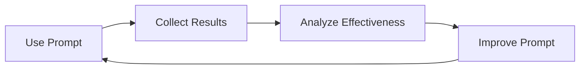

# AI Agent Prompts

## 🎯 Overview

This directory contains focused, reusable prompts for AI agents working on this project. Each prompt is designed to be DRY (Don't Repeat Yourself), referencing existing documentation rather than duplicating it.

## 📁 Directory Structure

```
prompts/
├── README.md                          # This file
├── feature-implementation.md          # Main implementation prompt
├── tdd-implementation.md             # TDD-specific prompt
├── code-review.md                    # Code review prompt (future)
├── documentation-update.md           # Documentation prompt (future)
└── templates/                        # Prompt templates (future)
```

## 🚀 Usage

### Choosing the Right Prompt

#### feature-implementation.md
**Use for**: Most feature implementations
**Best for**: General feature development following project patterns

#### tdd-implementation.md  
**Use for**: Complex features requiring high quality
**Best for**: Core functionality, critical components, complex logic

### Using Prompts

1. **Copy the prompt** content
2. **Replace placeholders** (e.g., `[FR-XXX]` with actual feature requirement)
3. **Provide to AI agent** along with access to project repository
4. **Monitor progress** and provide feedback

## 📝 Prompt Design Principles

### 1. DRY (Don't Repeat Yourself)
- **Reference existing documentation** rather than duplicating
- **Point to authoritative sources** for detailed information
- **Avoid redundancy** with project documentation

### 2. Focused and Actionable
- **Clear objectives** and success criteria
- **Specific steps** to follow
- **Concrete validation** commands

### 3. Context-Aware
- **Assume AI agent has repository access**
- **Reference specific files and directories**
- **Build on existing project patterns**

## 🔄 Prompt Evolution

### Version Control
- Use semantic versioning (v1.0.0, v1.1.0, etc.)
- Track effectiveness of prompt changes
- Document what works and what doesn't

### Feedback Loop


### Metrics to Track
- **Implementation Success Rate**: Features meeting acceptance criteria
- **Code Quality**: Automated quality scores  
- **Time to Completion**: Development velocity
- **Pattern Adherence**: Consistency with project standards

## 📊 Prompt Effectiveness

### Good Indicators
- ✅ AI agent reads required documentation
- ✅ Implementation follows established patterns
- ✅ All quality gates pass on first try
- ✅ Code integrates cleanly with existing system
- ✅ Acceptance criteria are met

### Warning Signs
- ❌ AI agent skips documentation reading
- ❌ Implementation doesn't follow project patterns
- ❌ Quality gates fail repeatedly
- ❌ Integration issues arise
- ❌ Acceptance criteria are missed

## 🛠️ Customizing Prompts

### For Specific Projects
1. **Update file paths** to match your project structure
2. **Adjust quality gates** to match your standards
3. **Modify workflows** to match your processes
4. **Add project-specific** requirements

### For Different AI Agents
1. **Claude Code**: Works well with file references and structured workflows
2. **GitHub Copilot**: Benefits from inline comments and examples
3. **Custom Agents**: May need additional context or formatting

## 📚 Supporting Documentation

### Project Documentation (Referenced by Prompts)
- `../workflows/tdd-workflow.md` - TDD methodology
- `../workflows/development-workflow.md` - Standard workflow
- `../../PROJECT_OVERVIEW.md` - Project context
- `../../CODING_STANDARDS.md` - Quality requirements
- `../../requirements/` - Feature specifications

### Implementation Resources (Used by AI Agents)
- `../../../templates/` - Code templates
- `../../../examples/` - Working examples
- `../../adr/` - Architecture decisions

## 🔧 Maintenance

### Regular Reviews
- **Monthly**: Review prompt effectiveness metrics
- **Quarterly**: Update prompts based on project evolution
- **After Major Changes**: Update prompts when project patterns change

### Update Triggers
- New architectural decisions (ADRs)
- Changes to coding standards
- New tools or workflows
- Feedback from AI agent usage

## 🤝 Contributing

### Adding New Prompts
1. Follow the DRY principle - reference existing docs
2. Make prompts focused and actionable
3. Test with actual AI agents
4. Document effectiveness metrics

### Improving Existing Prompts
1. Identify specific issues or inefficiencies
2. Propose targeted improvements
3. Test changes with AI agents
4. Measure impact on outcomes

---

