# Test-Driven Development Workflow for AI Agents

## Overview

This guide restructures the AI agent development workflow to follow strict Test-Driven Development (TDD) principles, providing tight feedback loops and ensuring quality from the first line of code.

## TDD Principles for AI Agents

### The Red-Green-Refactor Cycle

```mermaid
graph LR
    A[🔴 Write Failing Test] --> B[🟢 Write Minimal Code to Pass]
    B --> C[🔵 Refactor & Improve]
    C --> A
    
    style A fill:#ffcccc
    style B fill:#ccffcc  
    style C fill:#ccccff
```

### TDD Benefits for AI Agents
- **Immediate Feedback**: Know instantly if implementation is correct
- **Design Guidance**: Tests drive interface design and API structure
- **Regression Prevention**: Existing tests catch breaking changes
- **Documentation**: Tests serve as executable specifications
- **Confidence**: High test coverage enables fearless refactoring

## Updated Implementation Workflow

### Phase 1: TDD Setup and Test Infrastructure (30 minutes)

#### Step 1.1: Test Environment Setup

#### Step 1.2: Create Test Fixtures and Utilities

#### Step 1.3: Create Test Templates

### Phase 2: Red-Green-Refactor Cycles (2-3 hours)

#### Cycle 1: Basic Operation Structure (15 minutes)

#### Cycle 2: Operation Properties (10 minutes)

#### Cycle 3: Basic Functionality (15 minutes)

#### Cycle 4: Input Validation (20 minutes)

#### Cycle 5: Error Handling and Logging (20 minutes)

#### Cycle 6: Performance and Edge Cases (15 minutes)

### Phase 3: Integration Testing with TDD (30 minutes)

#### Integration Cycle 1: Integration

#### Integration Cycle 2: CLI Integration

### Phase 4: Refactoring and Optimization (20 minutes)

#### Refactoring Cycle 1: Extract Common Patterns

## TDD-Specific Guidelines for AI Agents

### 1. Always Start with Tests

### 2. Run Tests Frequently

### 3. Keep Cycles Short
- **🔴 RED**: 2-5 minutes to write a failing test
- **🟢 GREEN**: 5-10 minutes to make it pass
- **🔵 REFACTOR**: 2-5 minutes to improve code
- **Total Cycle**: 10-20 minutes maximum

### 4. Test Categories by TDD Phase

#### Red Phase Tests

#### Green Phase Tests  

#### Refactor Phase Tests

## TDD Quality Gates

### After Each Cycle
- [ ] **All Tests Pass**: Current test suite is green
- [ ] **No Regression**: Previous tests still pass
- [ ] **Coverage Increase**: New code is covered by tests
- [ ] **Fast Execution**: Test suite runs in < 30 seconds

### After Each Feature
- [ ] **Unit Tests**: 95%+ coverage for new code
- [ ] **Integration Tests**: Feature works with system
- [ ] **Performance Tests**: Meets performance requirements
- [ ] **Documentation**: Tests serve as documentation

## TDD Benefits for AI Agents

### 1. **Immediate Feedback**
- Know instantly if implementation is correct
- Catch errors before they propagate
- Validate assumptions continuously

### 2. **Design Guidance**
- Tests drive API design
- Force thinking about edge cases
- Ensure proper error handling

### 3. **Refactoring Confidence**
- Change implementation without fear
- Maintain behavior while improving structure
- Optimize with confidence

### 4. **Documentation**
- Tests show how to use the feature
- Examples of expected behavior
- Executable specifications

## Common TDD Pitfalls for AI Agents

### ❌ Avoid These Mistakes
- Writing multiple tests before making any pass
- Making tests too complex or testing multiple things
- Skipping the refactor phase
- Writing tests after implementation

### ✅ Follow These Practices
- One test at a time
- Simplest possible implementation to make test pass
- Regular refactoring with test coverage
- Tests drive the implementation, not the other way around

---

This TDD approach will give you much tighter feedback loops and higher quality code from your AI agents. The key is discipline - always write the test first, make it pass with minimal code, then refactor while keeping tests green.
