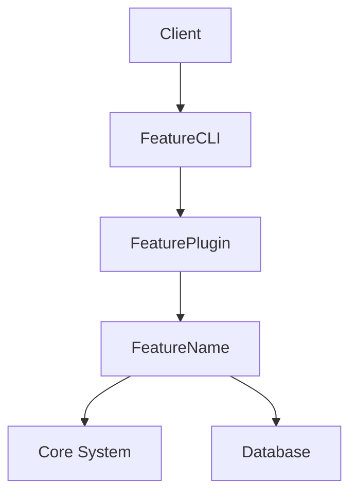

# AI Agent Development Workflow

## Overview

This document provides a comprehensive workflow for AI agents (Claude Code, GitHub Copilot, etc.) to implement features in the Media Analyzer project following industry best practices for agentic coding.

## Pre-Implementation Checklist

### 1. Context Gathering ✅
Before writing any code, AI agents must:

- [ ] **Read Feature Requirement**: Complete FR-XXX document in `docs/requirements/feature-specifications/`
- [ ] **Review Project Overview**: Read `PROJECT_OVERVIEW.md` for overall context
- [ ] **Check Coding Standards**: Review `CODING_STANDARDS.md` for quality requirements
- [ ] **Study API Reference**: Check `docs/API_REFERENCE.md` for interface contracts
- [ ] **Review Related ADRs**: Read relevant Architecture Decision Records from `docs/adr/`

### 2. Pattern Recognition 🔍
Identify the appropriate patterns and templates:

- [ ] **Feature Type**: Determine if this is a core operation, plugin, CLI command, etc.
- [ ] **Template Selection**: Choose primary template from `templates/` directory
- [ ] **Example Study**: Review similar implementations in `examples/` directory
- [ ] **Integration Points**: Identify where this feature connects to existing system

### 3. Technical Preparation 🛠️
Set up the implementation approach:

- [ ] **Architecture Review**: Understand how this fits into overall architecture
- [ ] **Dependency Check**: Identify required dependencies and imports
- [ ] **Test Strategy**: Plan testing approach based on feature requirements
- [ ] **Error Handling**: Plan error scenarios and handling strategy

## Implementation Workflow

### Phase 1: Foundation Setup

#### Step 1.1: Create File Structure

#### Step 1.2: Set Up Imports and Basic Structure
```python
"""
[Feature Name] Implementation

Implements: [List relevant ADRs]
See: docs/requirements/feature-specifications/FR-XXX-[feature-name].md

Architecture: Follows [relevant ADR patterns]
"""

# Standard library imports
import logging
from typing import Dict, List, Optional, Any, Union
from dataclasses import dataclass
from abc import ABC, abstractmethod

# Third-party imports (if needed)
import click  # For CLI features
import pytest  # For testing

# Project imports

# Set up logger
logger = get_logger(__name__)
```

#### Step 1.3: Create Basic Class Structure
```python
class [FeatureName]([BaseClass]):
    """
    [Feature description following docstring standards]
    
    Implements: [ADR references]
    
    Args:
        [parameter]: [description]
        
    Raises:
        [ExceptionType]: [when this exception is raised]
        
    Example:
        ```python
        feature = FeatureName()
        result = feature.method()
        ```
    """
    
    def __init__(self, config: Optional[Dict[str, Any]] = None):
        """Initialize [FeatureName] with optional configuration."""
        super().__init__()
        self.config = config or {}
        self.logger = get_logger(f"{__name__}.{self.__class__.__name__}")
        
        # TODO: Add feature-specific initialization
```

### Phase 2: Core Implementation

#### Step 2.1: Implement Core Methods
```python
def core_method(self, param1: Type1, param2: Type2) -> ReturnType:
    """
    [Method description]
    
    Args:
        param1: [description]
        param2: [description]
        
    Returns:
        ReturnType: [description]
        
    Raises:
        ValidationError: [when validation fails]
        OperationError: [when operation fails]
    """
    with LogContext(method="core_method", param1=param1, param2=param2):
        start_time = time.perf_counter()
        
        try:
            self.logger.debug("Starting core method execution")
            
            # Input validation
            self._validate_inputs(param1, param2)
            
            # Core logic implementation
            result = self._perform_operation(param1, param2)
            
            # Result validation
            self._validate_result(result)
            
            execution_time = (time.perf_counter() - start_time) * 1000
            self.logger.info(
                "Core method completed successfully",
                execution_time_ms=execution_time,
                result_type=type(result).__name__
            )
            
            return result
            
        except ValidationError:
            self.logger.warning("Input validation failed")
            raise
        except Exception as e:
            execution_time = (time.perf_counter() - start_time) * 1000
            self.logger.error(
                "Core method failed",
                error_type=type(e).__name__,
                error_message=str(e),
                execution_time_ms=execution_time
            )
            raise OperationError(
                f"Failed to execute core method: {str(e)}",
                original_error=e,
                context={"param1": param1, "param2": param2}
            )
```

#### Step 2.2: Implement Validation Methods
```python
def _validate_inputs(self, param1: Type1, param2: Type2) -> None:
    """Validate input parameters."""
    if param1 is None:
        raise ValidationError(
            "param1 cannot be None",
            field="param1",
            provided_value=param1
        )
    
    if not isinstance(param2, ExpectedType):
        raise ValidationError(
            f"param2 must be {ExpectedType.__name__}",
            field="param2",
            provided_value=param2,
            expected_type=ExpectedType.__name__
        )
    
    # Add feature-specific validation
```

#### Step 2.3: Implement Error Handling
```python
def _handle_operation_error(self, error: Exception, context: Dict[str, Any]) -> None:
    """Handle operation errors with proper logging and context."""
    error_context = {
        "operation": self.__class__.__name__,
        "error_type": type(error).__name__,
        "error_message": str(error),
        **context
    }
    
    if isinstance(error, ValidationError):
        self.logger.warning("Validation error occurred", **error_context)
    elif isinstance(error, SecurityError):
        self.logger.critical("Security error detected", **error_context)
    else:
        self.logger.error("Unexpected error occurred", **error_context)
```

### Phase 3: Integration Implementation

#### Step 3.1: CLI Integration (if applicable)
```python
# In separate CLI module or as part of main CLI
@click.command()
@click.option('--param1', type=str, required=True, help='Parameter 1 description')
@click.option('--param2', type=str, required=True, help='Parameter 2 description')
@click.pass_context
def feature_command(ctx, param1: str, param2: str):
    """CLI command for [feature name]."""
    try:
        feature = FeatureName()
        result = feature.core_method(param1, param2)
        
        click.echo(f"Result: {result}")
        
    except IconGenerationError as e:
        click.echo(f"Icon generation failed: {e.user_message}", err=True)
        ctx.exit(1)
    except Exception as e:
        click.echo(f"Unexpected error during icon generation: {str(e)}", err=True)
        ctx.exit(1)
```

#### Step 3.2: Plugin Integration (if applicable)
```python
def register_with_plugin_system(self, registry: OperationRegistry) -> None:
    """Register this feature with the plugin system."""
    try:
        registry.register_operation(self.name, self)
        self.logger.info(
            "Feature registered with plugin system",
            feature_name=self.name,
            registry_size=len(registry.operations)
        )
    except Exception as e:
        self.logger.error(
            "Failed to register with plugin system",
            error_type=type(e).__name__,
            error_message=str(e)
        )
        raise PluginError(
            f"Failed to register {self.name}: {str(e)}",
            plugin_name=self.name,
            original_error=e
        )
```

### Phase 4: Testing Implementation

#### Step 4.1: Unit Tests
```python
"""Unit tests for [FeatureName]."""

import pytest
from unittest.mock import Mock, patch, MagicMock
from media_analyzer.icon_gen import IconGenerator
from media_analyzer.core.exceptions import ValidationError, OperationError

class TestIconGenerator:
    """Test class for IconGenerator feature."""
    
    @pytest.fixture
    def feature(self):
        """Create FeatureName instance for testing."""
        return FeatureName()
    
    @pytest.fixture
    def mock_config(self):
        """Mock configuration for testing."""
        return {
            "param1": "test_value",
            "param2": 42
        }
    
    def test_initialization(self):
        """Test FeatureName initialization."""
        feature = FeatureName()
        assert feature is not None
        assert hasattr(feature, 'config')
        assert hasattr(feature, 'logger')
    
    def test_core_method_success(self, feature):
        """Test successful core method execution."""
        result = feature.core_method("valid_input", 123)
        assert result is not None
        # Add specific assertions based on expected behavior
    
    def test_core_method_validation_error(self, feature):
        """Test core method with invalid input."""
        with pytest.raises(ValidationError) as exc_info:
            feature.core_method(None, 123)
        
        assert "param1 cannot be None" in str(exc_info.value)
    
    def test_core_method_operation_error(self, feature):
        """Test core method operation failure."""
        with patch.object(feature, '_perform_operation', side_effect=Exception("Test error")):
            with pytest.raises(OperationError) as exc_info:
                feature.core_method("valid_input", 123)
        
        assert "Failed to execute core method" in str(exc_info.value)
        assert "Test error" in str(exc_info.value)
    
    @pytest.mark.parametrize("input1,input2,expected", [
        ("test1", 1, "expected_result1"),
        ("test2", 2, "expected_result2"),
        ("test3", 3, "expected_result3"),
    ])
    def test_core_method_parametrized(self, feature, input1, input2, expected):
        """Test core method with various inputs."""
        # Mock the internal method to return expected results
        with patch.object(feature, '_perform_operation', return_value=expected):
            result = feature.core_method(input1, input2)
            assert result == expected
    
    def test_logging_integration(self, feature, caplog):
        """Test that logging works correctly."""
        with caplog.at_level(logging.INFO):
            result = feature.core_method("valid_input", 123)
        
        # Check that appropriate log messages were created
        assert "Starting core method execution" in caplog.text
        assert "Core method completed successfully" in caplog.text
    
    def test_performance_requirements(self, feature):
        """Test that performance requirements are met."""
        import time
        
        start_time = time.perf_counter()
        result = feature.core_method("valid_input", 123)
        execution_time = (time.perf_counter() - start_time) * 1000
        
        # Ensure execution time meets requirements (adjust threshold as needed)
        assert execution_time < 100  # 100ms threshold
```

#### Step 4.2: Integration Tests
```python
"""Integration tests for IconGenerator."""

import pytest
import PIL.Image
from media_analyzer.icon_gen import IconGenerator
from media_analyzer.core.models import IconRequest
from media_analyzer.core.registry import OperationRegistry
from media_analyzer.core.storage import IconStorage
from media_analyzer.core.exceptions import IconGenerationError, ValidationError

class TestIconGeneratorIntegration:
    """Integration test class for IconGenerator."""
    
    @pytest.fixture
    def storage(self):
        """Create icon storage for testing."""
        return IconStorage(base_path="/tmp/test_icons")
    
    @pytest.fixture
    def generator(self, storage):
        """Create generator instance for testing."""
        return IconGenerator(
            storage=storage,
            config={
                "size": "256x256",
                "format": "png",
                "style": "minimalist"
            }
        )
    
    @pytest.fixture
    def registry(self):
        """Create registry for testing."""
        return OperationRegistry()
    
    def test_icon_generation_flow(self, generator, storage):
        """Test complete icon generation flow."""
        request = IconRequest(
            name="play-button",
            color_scheme="dark",
            category="media-controls"
        )
        
        # Generate icon
        icon = generator.generate_icon(request)
        
        # Verify icon was created
        assert icon.path.exists()
        assert icon.metadata.name == request.name
        assert icon.metadata.category == request.category
        
        # Verify image properties
        with PIL.Image.open(icon.path) as img:
            assert img.size == (256, 256)
            assert img.format == "PNG"
            
        # Verify storage
        assert storage.exists(icon.id)
        loaded_icon = storage.load(icon.id)
        assert loaded_icon.metadata == icon.metadata
    
    def test_plugin_integration(self, generator, registry):
        """Test integration with plugin system."""
        # Register generator
        generator.register_with_plugin_system(registry)
        assert generator.name in registry.operations
        
        # Execute through registry
        result = registry.execute_operation(
            "icon_generation",
            request=IconRequest(
                name="pause-button",
                color_scheme="light",
                category="media-controls"
            )
        )
        
        assert result is not None
        assert isinstance(result.path, Path)
        assert result.metadata.name == "pause-button"
    
    def test_error_handling(self, generator, registry):
        """Test error propagation in integrated environment."""
        generator.register_with_plugin_system(registry)
        
        with pytest.raises(ValidationError) as exc_info:
            registry.execute_operation(
                "icon_generation",
                request=IconRequest(
                    name=None,  # Invalid: name cannot be None
                    color_scheme="dark",
                    category="media-controls"
                )
            )
        assert "name cannot be None" in str(exc_info.value)
    
    def test_batch_generation(self, generator):
        """Test batch icon generation."""
        requests = [
            IconRequest(name=f"icon-{i}", 
                      color_scheme="dark" if i % 2 == 0 else "light",
                      category="media-controls")
            for i in range(10)
        ]
        
        results = generator.generate_batch(requests)
        assert len(results) == 10
        
        for req, res in zip(requests, results):
            assert res.metadata.name == req.name
            assert res.metadata.color_scheme == req.color_scheme
```

#### Step 4.3: Performance Tests
```python
"""Performance tests for IconGenerator."""

import pytest
import time
import PIL.Image
from pathlib import Path
from media_analyzer.icon_gen import IconGenerator
from media_analyzer.core.models import IconRequest, IconSize
from media_analyzer.core.storage import IconStorage

class TestIconGeneratorPerformance:
    """Performance test class for IconGenerator."""
    
    @pytest.fixture
    def storage(self):
        """Create icon storage for testing."""
        return IconStorage(base_path="/tmp/test_icons")
    
    @pytest.fixture
    def generator(self, storage):
        """Create optimized generator for testing."""
        return IconGenerator(
            storage=storage,
            config={
                "size": IconSize.MEDIUM,  # 256x256
                "format": "png",
                "style": "minimalist",
                "cache_enabled": True,
                "optimization_level": "high"
            }
        )
    
    def test_generation_latency(self, generator):
        """Test icon generation latency under normal conditions."""
        latencies = []
        iterations = 50  # Fewer iterations due to more complex operation
        
        request = IconRequest(
            name="play-button",
            color_scheme="dark",
            category="media-controls"
        )
        
        for _ in range(iterations):
            start_time = time.perf_counter()
            icon = generator.generate_icon(request)
            latency = (time.perf_counter() - start_time) * 1000
            latencies.append(latency)
            
            # Verify icon quality
            with PIL.Image.open(icon.path) as img:
                assert img.size == (256, 256)
                assert img.format == "PNG"
        
        avg_latency = sum(latencies) / len(latencies)
        p95_latency = sorted(latencies)[int(0.95 * iterations)]
        
        # Icon generation should be fast for simple icons
        assert avg_latency < 200  # 200ms average latency threshold
        assert p95_latency < 300  # 300ms P95 latency threshold
    
    def test_concurrent_generation(self, generator):
        """Test performance under concurrent icon generation."""
        import concurrent.futures
        
        def generate_icon(name: str):
            request = IconRequest(
                name=f"{name}-button",
                color_scheme="dark",
                category="media-controls"
            )
            return generator.generate_icon(request)
        
        icon_names = ["play", "pause", "stop", "next", "previous"]
        
        with concurrent.futures.ThreadPoolExecutor(max_workers=5) as executor:
            futures = [
                executor.submit(generate_icon, name)
                for name in icon_names * 10  # Generate each icon 10 times
            ]
            
            results = [
                future.result()
                for future in concurrent.futures.as_completed(futures)
            ]
        
        assert len(results) == len(icon_names) * 10
        
        # Verify all icons were generated correctly
        for icon in results:
            assert icon.path.exists()
            assert isinstance(icon.path, Path)
            with PIL.Image.open(icon.path) as img:
                assert img.size == (256, 256)
    
    def test_memory_efficiency(self, generator):
        """Test memory usage during repeated icon generation."""
        import psutil
        import os
        
        process = psutil.Process(os.getpid())
        initial_memory = process.memory_info().rss
        
        # Generate various icons multiple times
        for i in range(100):
            request = IconRequest(
                name=f"icon-{i % 10}",  # Cycle through 10 different icons
                color_scheme="dark" if i % 2 == 0 else "light",
                category="media-controls"
            )
            icon = generator.generate_icon(request)
            
            # Force cleanup
            del icon
        
        final_memory = process.memory_info().rss
        memory_increase = final_memory - initial_memory
        
        # Memory usage should be efficient due to caching and cleanup
        assert memory_increase < 50 * 1024 * 1024  # 50MB threshold
    
    def test_batch_generation_performance(self, generator):
        """Test performance of batch icon generation."""
        # Create a batch of icon requests
        requests = [
            IconRequest(
                name=f"icon-{i}",
                color_scheme="dark" if i % 2 == 0 else "light",
                category="media-controls"
            )
            for i in range(20)
        ]
        
        start_time = time.perf_counter()
        results = generator.generate_batch(requests)
        total_time = (time.perf_counter() - start_time) * 1000
        
        assert len(results) == len(requests)
        
        # Batch generation should be more efficient than individual generation
        average_time_per_icon = total_time / len(requests)
        assert average_time_per_icon < 150  # 150ms per icon in batch
```

### Phase 5: Documentation Implementation

#### Step 5.1: Update API Documentation
```python
"""
Update docs/API_REFERENCE.md with new feature documentation.

Example:

# [FeatureName] API Reference

## Overview
[Brief description of feature and its purpose]

## Classes

### FeatureName

Main class implementing [feature description].

#### Methods

##### core_method(param1: Type1, param2: Type2) -> ReturnType

Performs [operation description].

**Args:**
- param1 (Type1): [parameter description]
- param2 (Type2): [parameter description]

**Returns:**
ReturnType: [description of return value]

**Raises:**
- ValidationError: When input validation fails
- OperationError: When operation execution fails

**Example:**
```python
feature = FeatureName()
result = feature.core_method("input", 123)
```
"""

### Usage Examples
```python
# Basic usage
from media_analyzer.icon_gen import IconGenerator
from media_analyzer.core.models import IconRequest

# Initialize feature
icon_gen = IconGenerator(config={
    "size": "256x256",
    "format": "png",
    "style": "minimalist"
})

# Simple operation
request = IconRequest(
    name="play-button",
    color_scheme="dark",
    category="media-controls"
)
icon = icon_gen.generate_icon(request)
print(f"Generated icon path: {icon.path}")

# Error handling
try:
    invalid_request = IconRequest(
        name=None,  # Invalid: name cannot be None
        color_scheme="dark",
        category="media-controls"
    )
    icon = icon_gen.generate_icon(invalid_request)
except ValidationError as e:
    print(f"Icon request validation failed: {e}")
except OperationError as e:
    print(f"Icon generation failed: {e}")

# Advanced usage
icon_gen.register_with_plugin_system(registry)
registry.execute_operation(
    "icon_generation",
    request=IconRequest(name="pause-button", color_scheme="light", category="media-controls")
)
```

#### Step 5.2: Update User Documentation
```markdown
# [FeatureName] User Guide

## Overview
[Feature name] provides [brief description of feature purpose and benefits].

## Installation
```bash
pip install media-analyzer
```

## Basic Usage
```python
from media_analyzer.icon_gen import IconGenerator
from media_analyzer.core.models import IconRequest

generator = IconGenerator()
icon = generator.generate_icon(IconRequest(
    name="play-button",
    color_scheme="dark",
    category="media-controls"
))
```

## Configuration
The feature supports the following configuration options:

- `option1`: [description]
- `option2`: [description]

Example configuration:
```python
config = {
    "option1": "value1",
    "option2": "value2"
}
feature = FeatureName(config=config)
```

## Advanced Usage
[Description of advanced features and use cases]

## Error Handling
Common errors and how to handle them:

1. ValidationError
   - Cause: Invalid input parameters
   - Solution: Check input types and values

2. OperationError
   - Cause: Operation execution failure
   - Solution: Verify operation parameters and system state

## Performance Considerations
- Recommended usage patterns
- Performance limits and thresholds
- Optimization tips


#### Step 5.3: Update Architecture Documentation
```markdown
# Architecture Update for [FeatureName]

## Component Overview
[Feature name] introduces the following components:
- FeatureName class: Core implementation
- FeaturePlugin: Plugin system integration
- FeatureCLI: Command-line interface

## System Integration


## Data Flow
1. Client initiates operation
2. CLI validates input
3. Plugin system routes request
4. Feature processes operation
5. Results returned through chain

## Design Decisions
- [List key architectural decisions]
- [Reference relevant ADRs]
```

### Phase 6: Quality Assurance

#### Step 6.1: Automated Quality Checks
```python
"""Quality check configuration and scripts."""

# mypy configuration
MYPY_CONFIG = """
[mypy]
python_version = 3.9
warn_return_any = True
warn_unused_configs = True
disallow_untyped_defs = True
disallow_incomplete_defs = True
check_untyped_defs = True
disallow_untyped_decorators = True
no_implicit_optional = True
warn_redundant_casts = True
warn_unused_ignores = True
warn_no_return = True
warn_unreachable = True
"""

# ruff configuration
RUFF_CONFIG = """
select = ["E", "F", "B", "I", "N", "UP", "ANN", "S", "A", "COM", "C4", "T20", "PT"]
ignore = []
line-length = 88
target-version = "py39"
"""

# Test coverage configuration
COVERAGE_CONFIG = """
[run]
branch = True
source = media_analyzer

[report]
exclude_lines =
    pragma: no cover
    def __repr__
    if __name__ == .__main__.:
    raise NotImplementedError
"""
```

#### Step 6.2: Security Review
```python
"""Security review checklist and configuration."""

SECURITY_CHECKS = [
    # Input Validation
    "Validate all input parameters",
    "Sanitize file paths",
    "Escape special characters",
    
    # Access Control
    "Verify authentication",
    "Check authorization",
    "Validate permissions",
    
    # Data Protection
    "Encrypt sensitive data",
    "Use secure protocols",
    "Implement rate limiting",
    
    # Error Handling
    "Sanitize error messages",
    "Log security events",
    "Handle failures gracefully"
]

# Bandit security scanner configuration
BANDIT_CONFIG = """
[bandit]
targets: media_analyzer/icon_gen
exclude: /tests
```

#### Step 6.3: Performance Validation
```python
"""Performance validation configuration and benchmarks."""

PERFORMANCE_REQUIREMENTS = {
    "latency": {
        "average": 50,  # ms
        "p95": 100,    # ms
        "p99": 200     # ms
    },
    "throughput": {
        "single_thread": 1000,  # ops/sec
        "multi_thread": 5000    # ops/sec
    },
    "memory": {
        "base_usage": 50,       # MB
        "max_increase": 100     # MB
    },
    "cpu": {
        "average_usage": 30,    # percent
        "peak_usage": 80        # percent
    }
}

# Locust load test configuration
LOCUST_CONFIG = """
from locust import HttpUser, task, between

class FeatureLoadTest(HttpUser):
    wait_time = between(1, 2)
    
    @task
    def test_icon_generation(self):
        self.client.post(
            "/api/icons/generate",
            json={
                "name": "play-button",
                "color_scheme": "dark",
                "category": "media-controls"
            }
        )
"""


### Phase 7: Deployment Preparation

#### Step 7.1: Configuration Management

#### Step 7.2: Migration Strategy
```python
# If feature changes existing functionality
def migrate_existing_data():
    """Migration strategy for existing data/configuration."""
    # Handle backward compatibility
    # Migrate existing configurations
    # Update existing data structures
    pass
```

#### Step 7.3: Rollback Plan
```python
# Rollback strategy
def rollback_feature():
    """Rollback plan if feature needs to be disabled."""
    # Disable feature in configuration
    # Restore previous functionality
    # Clean up feature-specific data
    pass
```

## Quality Gates Checklist

Before considering a feature complete, AI agents must verify:

### Code Quality Gates ✅
- [ ] **Type Checking**: 100% mypy compliance with strict mode
- [ ] **Linting**: 100% ruff compliance with project configuration
- [ ] **Test Coverage**: Minimum 90% coverage for new code
- [ ] **Documentation**: All public APIs documented with examples
- [ ] **Error Handling**: All error paths tested and documented
- [ ] **Performance**: Meets specified performance requirements
- [ ] **Security**: Passes security static analysis
- [ ] **Code Review**: Passes automated code review checks

### Testing Gates ✅
- [ ] **Unit Tests**: All tests pass with no flakes
- [ ] **Integration Tests**: Feature works with existing components
- [ ] **Performance Tests**: Meets latency and throughput requirements
- [ ] **Error Cases**: All error paths tested
- [ ] **Edge Cases**: Boundary conditions verified
- [ ] **Load Tests**: Handles expected load scenarios

### Documentation Gates ✅
- [ ] **API Reference**: Updated with new endpoints/methods
- [ ] **Usage Examples**: Added practical usage examples
- [ ] **Architecture Docs**: Updated with new components
- [ ] **Release Notes**: Added feature description
- [ ] **Test Documentation**: Added test scenarios and cases
- [ ] **Error Documentation**: All error conditions documented
