# Test-Driven Development Workflow for AI Agents

## Overview

This guide restructures the AI agent development workflow to follow strict Test-Driven Development (TDD) principles, providing tight feedback loops and ensuring quality from the first line of code.

## Core Principles

1. **Always Start with Tests**
   - Write failing tests first
   - Define expected behavior clearly
   - Cover edge cases and error conditions
   - Use descriptive test names

2. **Run Tests Frequently**
   - Execute tests after every change
   - Maintain fast test execution
   - Fix failing tests immediately
   - Monitor code coverage

3. **Keep Code Clean**
   - Regular refactoring
   - Clear naming conventions
   - Single responsibility
   - Comprehensive documentation

## TDD Principles for AI Agents

### The Red-Green-Refactor Cycle

```mermaid
graph LR
    A[🔴 Write Failing Test] --> B[🟢 Write Minimal Code to Pass]
    B --> C[🔵 Refactor & Improve]
    C --> A
    
    style A fill:#ffcccc
    style B fill:#ccffcc  
    style C fill:#ccccff
```

### TDD Benefits for AI Agents
- **Immediate Feedback**: Know instantly if implementation is correct
- **Design Guidance**: Tests drive interface design and API structure
- **Regression Prevention**: Existing tests catch breaking changes
- **Documentation**: Tests serve as executable specifications
- **Confidence**: High test coverage enables fearless refactoring

## Updated Implementation Workflow

### Phase 1: TDD Setup and Test Infrastructure (30 minutes)

#### Step 1.1: Test Environment Setup
- Initialize pytest configuration
- Set up coverage reporting
- Configure test database if needed
- Set up mock services and fixtures

#### Step 1.2: Create Test Fixtures and Utilities
- Define common test data
- Create mock objects and factories
- Set up helper functions
- Establish cleanup procedures

#### Step 1.3: Create Test Templates
- Define test class structure
- Set up common test patterns
- Create shared test utilities
- Establish naming conventions

### Phase 2: Red-Green-Refactor Cycles (2-3 hours)

#### Cycle 1: Basic Operation Structure (15 minutes)
1. **Red**: Write test for basic class/function structure
2. **Green**: Create minimal implementation
3. **Refactor**: Improve naming and organization

#### Cycle 2: Operation Properties (10 minutes)
1. **Red**: Test required properties and methods
2. **Green**: Add property implementations
3. **Refactor**: Optimize property access

#### Cycle 3: Basic Functionality (15 minutes)
1. **Red**: Test core business logic
2. **Green**: Implement main functionality
3. **Refactor**: Extract common patterns

#### Cycle 4: Input Validation (20 minutes)
1. **Red**: Test input validation rules
2. **Green**: Add validation logic
3. **Refactor**: Centralize validation

#### Cycle 5: Error Handling and Logging (20 minutes)
1. **Red**: Test error scenarios
2. **Green**: Implement error handling
3. **Refactor**: Improve error messages

#### Cycle 6: Performance and Edge Cases (15 minutes)
1. **Red**: Test performance requirements
2. **Green**: Optimize implementation
3. **Refactor**: Clean up optimizations

### Phase 3: Integration Testing with TDD (30 minutes)

#### Integration Cycle 1: Integration
1. **Write Integration Tests**
   - Test component interactions
   - Verify data flow
   - Check error propagation

2. **Implement Integration**
   - Connect components
   - Handle cross-cutting concerns
   - Verify system behavior

3. **Optimize Integration**
   - Performance tuning
   - Resource management
   - Error handling refinement

#### Integration Cycle 2: CLI Integration
1. **CLI Test Cases**
   - Command structure tests
   - Input validation tests
   - Output format tests
   - Error handling tests

2. **CLI Implementation**
   - Command implementation
   - Help documentation
   - Error messages
   - Progress indicators

3. **CLI Refinement**
   - User experience improvements
   - Performance optimization
   - Documentation updates

### Phase 4: Refactoring and Optimization (20 minutes)

#### Refactoring Cycle 1: Extract Common Patterns

## TDD-Specific Guidelines for AI Agents

### 1. Always Start with Tests
- Write the smallest possible test that fails
- Define expected behavior before implementation
- Focus on one piece of functionality at a time
- Use test names to document behavior
- Structure: `test_[unit_of_work]_[scenario]_[expected_result]`

### 2. Run Tests Frequently
- Run tests after every code change
- Use pytest watch mode for instant feedback
- Fix failing tests immediately
- Keep test suite fast (< 30 seconds)

### 3. Keep Cycles Short
- **🔴 RED**: 2-5 minutes to write a failing test
- **🟢 GREEN**: 5-10 minutes to make it pass
- **🔵 REFACTOR**: 2-5 minutes to improve code
- **Total Cycle**: 10-20 minutes maximum

### 4. Test Categories by TDD Phase

#### Red Phase Tests
1. **Basic Functionality Tests**
   - Simple input/output validation
   - Core feature behavior
   - Happy path scenarios

2. **Edge Case Tests**
   - Boundary conditions
   - Invalid inputs
   - Resource constraints

3. **Error Handling Tests**
   - Expected exceptions
   - Error messages
   - Recovery behavior

#### Green Phase Tests
1. **Implementation Verification**
   - Minimal code to pass tests
   - No premature optimization
   - Focus on correctness first

2. **Coverage Checks**
   - All code paths exercised
   - Branch coverage
   - Exception paths tested

3. **Integration Points**
   - Dependencies properly mocked
   - Contracts verified
   - Side effects contained

#### Refactor Phase Tests
1. **Performance Tests**
   - Response time requirements
   - Resource usage limits
   - Scalability checks

2. **Maintainability Tests**
   - Code complexity metrics
   - Dependency injection
   - Interface consistency

3. **Quality Gates**
   - Style compliance (black/ruff)
   - Type safety (mypy)
   - Documentation coverage

## TDD Quality Gates

### After Each Cycle
- [ ] **All Tests Pass**: Current test suite is green
- [ ] **No Regression**: Previous tests still pass
- [ ] **Coverage Increase**: New code is covered by tests
- [ ] **Fast Execution**: Test suite runs in < 30 seconds

### After Each Feature
- [ ] **Unit Tests**: 95%+ coverage for new code
- [ ] **Integration Tests**: Feature works with system
- [ ] **Performance Tests**: Meets performance requirements
- [ ] **Documentation**: Tests serve as documentation

## Effective TDD Workflow for Implementation

## Core Components
- Test First Development
- Continuous Integration
- Iterative Development
- Quality Gates

## Development Principles
1. **Write Tests First**
   - Define expected behavior
   - Cover edge cases
   - Plan error scenarios

2. **Keep Tests Focused**
   - One assertion per test
   - Clear test descriptions
   - Isolated test cases

3. **Maintain Test Quality**
   - Regular test refactoring
   - High code coverage
   - Fast execution time

## Common TDD Pitfalls for AI Agents

### ❌ Avoid These Mistakes
- Writing multiple tests before making any pass
- Making tests too complex or testing multiple things
- Skipping the refactor phase
- Writing tests after implementation

### ✅ Follow These Practices
- One test at a time
- Simplest possible implementation to make test pass
- Regular refactoring with test coverage
- Tests drive the implementation, not the other way around

---

This TDD approach will give you much tighter feedback loops and higher quality code from your AI agents. The key is discipline - always write the test first, make it pass with minimal code, then refactor while keeping tests green.
