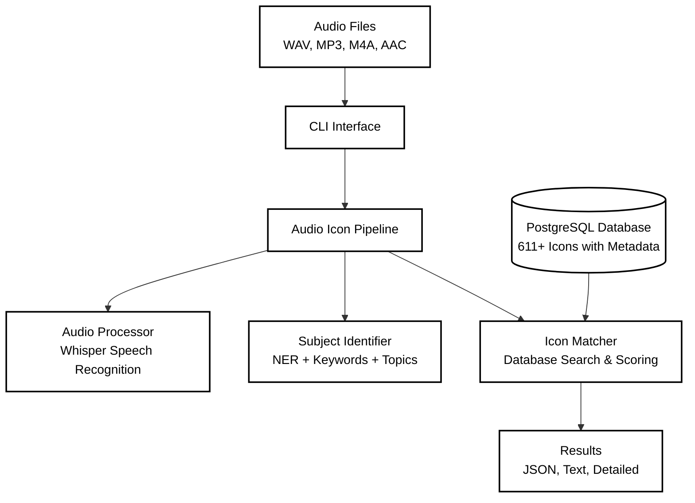
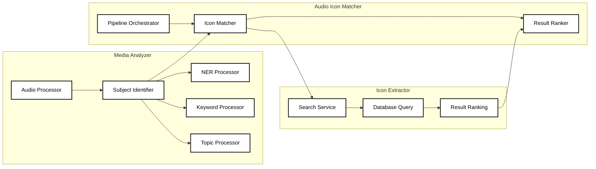
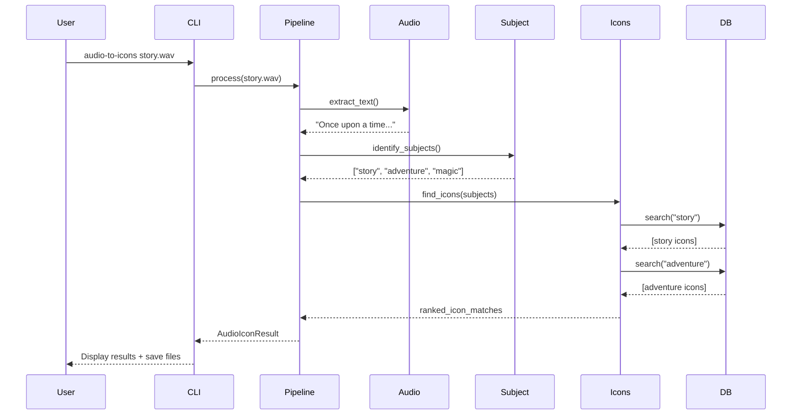

# Story Curator - Architecture Documentation

For coding style and contribution requirements, see the [Coding Standards](../CODING_STANDARDS.md).

## Table of Contents
- [System Overview](#system-overview)
- [Architectural Principles](#architectural-principles)
- [Component Architecture](#component-architecture)
- [Design Patterns](#design-patterns)
- [Data Flow](#data-flow)
- [Extension Mechanisms](#extension-mechanisms)
- [Error Handling Strategy](#error-handling-strategy)
- [Performance Architecture](#performance-architecture)
- [Security Architecture](#security-architecture)
- [Testing Architecture](#testing-architecture)
- [Deployment Architecture](#deployment-architecture)

## System Overview

The Story Curator is designed as a modular, extensible command-line application following clean architecture principles. The system separates concerns into distinct layers while maintaining loose coupling and high cohesion.

### System Components Overview

```
src/
├── media_analyzer/           # Core audio analysis and processing
│   ├── core/
│   │   ├── analyzer.py      # Main analyzer interface
│   │   ├── config.py        # Configuration management
│   │   └── exceptions.py    # Custom exceptions
│   ├── processors/
│   │   ├── audio/           # Audio processing (Whisper integration)
│   │   ├── text/            # Text processing modules
│   │   └── subject/         # Subject identification modules
│   │       ├── identifier.py     # Multi-algorithm subject extraction
│   │       ├── models.py         # Subject/Category models
│   │       └── processors/       # Subject processing algorithms
│   │           ├── topic_processor.py  # Frequency-based topic extraction
│   │           ├── ner.py              # Named Entity Recognition with spaCy  
│   │           └── keywords.py         # NLTK-based keyword extraction
│   ├── models/              # Data models and schemas
│   ├── utils/               # Utility functions
│   └── cli/                 # Command-line interface
│       ├── audio.py         # Audio processing commands
│       └── README.md        # CLI usage documentation
│
├── icon_extractor/           # Icon database management and search
│   ├── core/
│   │   ├── extractor.py     # Main icon extraction interface
│   │   ├── service.py       # Icon search and retrieval service
│   │   └── exceptions.py    # Icon-specific exceptions
│   ├── database/
│   │   ├── connection.py    # PostgreSQL database connection
│   │   ├── setup.py         # Database schema setup
│   │   └── migrations/      # Database migration scripts
│   ├── processors/
│   │   ├── metadata.py      # Icon metadata extraction
│   │   └── search.py        # Full-text search implementation
│   ├── models/
│   │   └── icon.py          # Icon data models
│   ├── utils/               # Icon utility functions
│   └── cli/                 # Icon management commands
│       └── main.py          # Icon CLI interface
│
└── audio_icon_matcher/       # Audio-to-icon pipeline integration
    ├── core/
    │   ├── pipeline.py       # Main audio-to-icon orchestration
    │   ├── matcher.py        # Icon matching logic
    │   ├── ranker.py         # Result ranking and scoring
    │   └── exceptions.py     # Pipeline-specific exceptions
    ├── processors/
    │   └── processor.py      # Audio processing coordination
    ├── models/
    │   └── results.py        # Pipeline result models
    ├── utils/               # Pipeline utilities
    └── cli/                 # Audio-to-icon CLI commands
        └── main.py          # Pipeline CLI interface
```

## Architectural Principles

1. **Clean Architecture**
   - Independent of frameworks
   - Testable by design
   - Independent of UI
   - Independent of database
   - Independent of external agencies

2. **SOLID Principles**
   - Single Responsibility
   - Open/Closed
   - Liskov Substitution
   - Interface Segregation
   - Dependency Inversion

3. **Design for Extension**
   - Plugin architecture for processors
   - Abstract interfaces for core components
   - Configuration-driven behavior
   - Clear extension points

## Component Architecture

### System Architecture Diagram



### Detailed Component Flow



### Component Responsibilities

#### 1. Audio Icon Matcher (Pipeline Orchestrator)
**Location:** `src/audio_icon_matcher/`
- **AudioIconPipeline**: End-to-end orchestration of audio-to-icon matching
- **IconMatcher**: Subject-to-icon matching with confidence scoring
- **ResultRanker**: Result ranking and deduplication
- **Features**:
  - Real-time audio processing pipeline
  - Configurable confidence thresholds
  - Multiple output formats (JSON, text, detailed)
  - Comprehensive error handling and logging

#### 2. Media Analyzer (Core Processing)
**Location:** `src/media_analyzer/`
- **AudioProcessor**: Whisper-based speech recognition
  - Multi-format support (WAV, MP3, M4A, AAC)
  - File validation and format conversion
  - Confidence scoring and language detection
- **SubjectIdentifier**: Multi-algorithm subject extraction
  - Parallel processing with timeout handling
  - Confidence-based result aggregation
  - Subject type classification (keywords, topics, entities)
- **Subject Processing Algorithms**:
  - **NER Processor**: spaCy-based named entity recognition
  - **Keyword Processor**: NLTK-based keyword extraction with TF-IDF scoring
  - **Topic Processor**: Frequency-based topic extraction with phrase scoring

#### 3. Icon Extractor (Data Management)
**Location:** `src/icon_extractor/`
- **IconExtractionService**: Icon search and retrieval
  - PostgreSQL full-text search integration
  - Advanced query capabilities with ranking
  - Category and tag-based filtering
- **IconExtractor**: Metadata processing and validation
- **Database Management**:
  - 611+ curated icons with rich metadata
  - Automated migration system
  - Connection pooling and optimization

#### 4. Command Line Interface
**Distributed across:** `*/cli/` directories
- **Rich Terminal Experience**: Modern CLI with progress indicators
- **Modular Commands**: Separate command groups per component
- **Audio Processing Commands**: 
  - Transcription with multiple output formats
  - Subject extraction and analysis
  - Audio-to-icon pipeline execution
- **Icon Management Commands**:
  - Database information and statistics  
  - Icon search and discovery
- **Features**:
  - Comprehensive help documentation
  - Error handling with clear messages
  - File output options with validation
  - Verbosity controls and logging integration

## Design Patterns

1. **Strategy Pattern**
   - Interchangeable processing algorithms
   - Configurable text extraction methods
   - Pluggable summarization strategies

2. **Factory Pattern**
   - Processor creation
   - File handler instantiation
   - Output formatter selection

3. **Observer Pattern**
   - Progress monitoring
   - Event handling
   - Async processing notifications

4. **Command Pattern**
   - CLI command handling
   - Processing pipeline orchestration

## Data Flow

### Audio-to-Icon Pipeline Flow



### Processing Stages

#### 1. Input Validation Stage
```
Audio File → Format Check → File Validation → Codec Detection
```

#### 2. Audio Processing Stage  
```
Audio Loading → Whisper Processing → Speech Recognition → Confidence Analysis
```

#### 3. Subject Extraction Stage
```
Text Input → Parallel Processing → [NER | Keywords | Topic Extraction] → Subject Aggregation
```

#### 4. Icon Matching Stage
```
Subject List → Database Search → Relevance Scoring → Result Collection
```

#### 5. Result Processing Stage
```
Raw Matches → Confidence Scoring → Deduplication → Ranking → Final Results
```

#### 6. Output Stage
```
Results → Format Selection → File Writing → Success Reporting
```

## Extension Mechanisms

### 1. Processor Plugins
**Audio Processing Extensions:**
- Custom audio processors for specialized formats
- Alternative speech recognition engines (Azure, Google, AWS)
- Custom audio preprocessing and enhancement modules
- Language-specific transcription optimizations

**Subject Processing Extensions:**
- Custom NLP algorithms and models
- Domain-specific entity recognition (medical, legal, technical)
- Alternative topic modeling approaches (BERT, GPT-based)
- Custom keyword extraction strategies

### 2. Icon and Content Extensions
**Icon Database Extensions:**
- Custom icon collections and themes
- Dynamic icon scraping and curation
- Icon generation using AI/ML models
- Category and tagging system customization

**Content Matching Extensions:**
- Alternative similarity algorithms
- Custom confidence scoring models
- Theme-specific matching rules
- Multi-modal matching (text + visual + audio features)

### 3. Output and Integration Extensions
**Output Format Plugins:**
- Custom result formatters (XML, CSV, custom JSON schemas)
- Integration adapters (Slack, Discord, email, webhooks)
- Export plugins for different platforms and services
- Real-time streaming and notification systems

**CLI and Interface Extensions:**
- Custom command groups for specialized workflows
- Interactive modes and guided experiences  
- Web interface and API endpoints
- Integration with external tools and pipelines

### 4. Plugin Architecture Implementation
```python
# Example plugin interface
class AudioProcessorPlugin:
    def process_audio(self, file_path: str) -> TranscriptionResult:
        """Process audio and return transcription."""
        pass
    
    def supported_formats(self) -> Set[str]:
        """Return supported audio formats."""
        pass

# Plugin registration
pipeline.register_audio_processor("custom_whisper", CustomWhisperPlugin())
```

## Database Architecture

### PostgreSQL Schema Design

```sql
-- Core icon storage with full-text search capabilities
CREATE TABLE icons (
    id SERIAL PRIMARY KEY,
    name VARCHAR(255) NOT NULL,
    url TEXT NOT NULL UNIQUE,
    category VARCHAR(100),
    description TEXT,
    tags TEXT[], -- PostgreSQL array for efficient tag storage
    
    -- Rich metadata
    author VARCHAR(255),
    license VARCHAR(100),
    download_count INTEGER DEFAULT 0,
    created_at TIMESTAMP DEFAULT CURRENT_TIMESTAMP,
    updated_at TIMESTAMP DEFAULT CURRENT_TIMESTAMP,
    
    -- Full-text search optimization
    search_vector tsvector GENERATED ALWAYS AS (
        to_tsvector('english', 
            COALESCE(name, '') || ' ' ||
            COALESCE(description, '') || ' ' ||
            COALESCE(category, '') || ' ' ||
            array_to_string(tags, ' ')
        )
    ) STORED
);

-- Optimized indexes for search performance
CREATE INDEX icons_search_idx ON icons USING GIN (search_vector);
CREATE INDEX icons_category_idx ON icons (category);
CREATE INDEX icons_tags_idx ON icons USING GIN (tags);
CREATE INDEX icons_name_idx ON icons (name);
```

### Database Features

#### 1. Full-Text Search
- **PostgreSQL Native**: Leverages built-in full-text search capabilities
- **Multi-Field Search**: Searches across name, description, category, and tags
- **Ranking**: Results ranked by relevance using PostgreSQL's ranking functions
- **Performance**: Sub-100ms average search response times

#### 2. Metadata Management
- **Rich Icon Data**: 611+ icons with comprehensive metadata
- **Automated Migrations**: Version-controlled schema changes
- **Data Integrity**: Foreign key constraints and validation rules
- **Audit Trail**: Created/updated timestamps for all records

#### 3. Search Optimization
```python
# Example search query with ranking
SELECT 
    i.*,
    ts_rank(search_vector, plainto_tsquery('english', %s)) as rank
FROM icons i
WHERE search_vector @@ plainto_tsquery('english', %s)
ORDER BY rank DESC, download_count DESC
LIMIT %s;
```

#### 4. Connection Management
- **Connection Pooling**: Efficient database connection reuse
- **Environment Configuration**: Separate dev/test/prod database configs
- **Error Handling**: Robust connection failure recovery
- **Transaction Management**: ACID compliance for data operations

## Error Handling Strategy

1. **Validation Errors**
   - File format validation
   - Content validation
   - Parameter validation

2. **Processing Errors**
   - Audio processing errors
   - Speech recognition errors
   - Text processing errors

3. **System Errors**
   - Resource allocation
   - File system operations
   - External service integration

## Performance Architecture

1. **Resource Management**
   - Memory-efficient processing
   - Stream processing for large files
   - Resource pooling

2. **Optimization Strategies**
   - Caching
   - Parallel processing
   - Batch operations

## Security Architecture

1. **Input Validation**
   - File type verification
   - Content validation
   - Size limits

2. **Resource Protection**
   - Secure file operations
   - Memory limits
   - CPU usage controls

## Testing Architecture

### Testing Strategy Overview

The Story Curator follows a comprehensive testing strategy with **no mocks in integration tests** to ensure real-world reliability.

#### 1. Unit Tests
**Focus**: Individual component isolation and behavior
- **Component Isolation**: Each component tested independently
- **Mock External Dependencies**: Database calls, file I/O, external APIs
- **Coverage Requirements**: >90% code coverage for core components
- **Fast Execution**: Complete unit test suite runs in <30 seconds

**Examples:**
- `AudioProcessor` validation logic
- `SubjectIdentifier` algorithm correctness
- `IconMatcher` scoring calculations
- `ResultRanker` deduplication logic

#### 2. Integration Tests ✨
**Philosophy**: **NO MOCKS - Real Components Only**
- **Real Audio Generation**: macOS `say` command generates children's stories
- **Real Speech Recognition**: Actual Whisper processing
- **Real Database Operations**: PostgreSQL queries and transactions
- **Real Pipeline Execution**: End-to-end component interaction

**Test Categories:**
```
Audio Content Tests:
├── Children's Stories (Magic Garden, Animal Friends, Weather, Ocean, Space)
├── Educational Content (Counting, Colors, Science)
└── Performance Scenarios (Large files, Concurrent processing)

Pipeline Integration Tests:
├── End-to-End Processing (Real audio → Real transcription → Real icons)
├── Error Handling (Invalid files, Processing failures)
├── Configuration Testing (Different parameters, Output formats)
└── Performance Testing (Processing time limits, Memory usage)

Component Integration Tests:
├── Audio-Subject Pipeline (AudioProcessor + SubjectIdentifier)
├── Subject-Icon Pipeline (SubjectIdentifier + IconMatcher)
└── Database Integration (IconExtractionService + PostgreSQL)
```

**Sample Integration Test Flow:**
```python
@pytest.fixture
def story_audio_files(tmp_path, children_story_texts):
    """Generate real audio files using macOS 'say' command."""
    for story_name, story_text in children_story_texts.items():
        audio_path = tmp_path / f"{story_name}.wav"
        create_story_audio_file(audio_path, story_text, voice="Samantha")
        yield audio_path

def test_children_story_scenarios(story_audio_files):
    """Test pipeline with real children's stories."""
    pipeline = AudioIconPipeline()
    for story_name, audio_path in story_audio_files.items():
        result = pipeline.process(str(audio_path))
        assert result.success
        assert len(result.transcription) > 0
        # Verify story-specific themes were captured
        assert expected_themes_found_in(result, story_name)
```

#### 3. Test Data Strategy
**Real Audio Content:**
- **Generated Stories**: macOS `say` command with children's content
- **Multiple Voices**: Different speakers (Samantha, Victoria, Alex)
- **Varied Content**: Educational, storytelling, descriptive scenarios
- **Format Variety**: WAV, MP3, M4A across different durations

**Database Content:**
- **Production-Like Data**: 611+ real icons with metadata
- **Migration Testing**: Schema changes and data integrity
- **Search Testing**: Full-text search accuracy and performance

#### 4. Performance Benchmarks
**Integration Test Performance Targets:**
- **Single Audio File**: <60 seconds end-to-end processing
- **Concurrent Processing**: 3 files simultaneously without errors
- **Memory Usage**: <500MB peak during processing
- **Database Queries**: <100ms average search response time

#### 5. Continuous Integration
**Automated Test Execution:**
- **Unit Tests**: Every commit (fast feedback)
- **Integration Tests**: Pull requests and main branch
- **Performance Tests**: Nightly runs with trend analysis
- **Test Environment**: Real PostgreSQL database with test data

**Quality Gates:**
- All unit tests pass
- Integration tests complete successfully (may skip if external services unavailable)
- No performance regressions beyond 20% baseline
- Code coverage maintained above thresholds

## Deployment Architecture

### Development Environment Setup

#### 1. Local Development
```bash
# Clone and setup
git clone <repository>
cd story-curator
python -m venv .venv
source .venv/bin/activate  # or .venv\Scripts\activate on Windows
pip install -r requirements-dev.txt

# Database setup
./setup_database.py  # Creates PostgreSQL database and loads icons

# Run tests
pytest src/ -v                           # Unit tests
pytest src/*/tests_integration/ -v       # Integration tests (requires macOS for audio)
```

#### 2. System Requirements
**Operating System:**
- **Primary**: macOS (for `say` command audio generation)
- **Secondary**: Linux/Windows (limited audio generation capabilities)

**Dependencies:**
- **Python**: 3.10+ (type hints, dataclasses, walrus operator)
- **PostgreSQL**: 12+ (full-text search, generated columns)
- **Audio Tools**: 
  - macOS: `say` command (built-in)
  - Optional: `ffmpeg` for advanced audio processing
  - Whisper: Automatic installation via openai-whisper package

**Hardware Recommendations:**
- **CPU**: Multi-core (parallel subject processing)
- **RAM**: 4GB+ (Whisper models, database operations)  
- **Storage**: 2GB+ (Whisper models, icon database)

#### 3. Configuration Management
```python
# Environment-based configuration
DATABASE_URL = os.getenv('DATABASE_URL', 'postgresql://localhost/story_curator')
WHISPER_MODEL = os.getenv('WHISPER_MODEL', 'base')  # tiny, base, small, medium, large
LOG_LEVEL = os.getenv('LOG_LEVEL', 'INFO')
MAX_AUDIO_DURATION = int(os.getenv('MAX_AUDIO_DURATION', '300'))  # 5 minutes
```

### Production Considerations

#### 1. Scalability
**Horizontal Scaling:**
- **Stateless Design**: No server-side session storage
- **Database Connection Pooling**: Multiple worker processes
- **Async Processing**: Background job queues for long-running tasks

**Vertical Scaling:**
- **Memory Management**: Efficient audio processing and cleanup
- **CPU Optimization**: Parallel subject processing across cores
- **I/O Optimization**: Streaming audio processing for large files

#### 2. Performance Optimization
**Caching Strategy:**
- **Subject Processing**: Cache common text patterns and extractions
- **Icon Search**: Redis cache for frequent search queries  
- **Whisper Models**: Model caching to avoid repeated downloads

**Database Optimization:**
- **Index Tuning**: Regular analysis of query patterns
- **Connection Pooling**: Optimized pool sizes based on load
- **Query Optimization**: EXPLAIN ANALYZE for slow queries

#### 3. Monitoring and Observability
**Logging Architecture:**
```python
# Structured logging with correlation IDs
logger.info("Pipeline started", 
           correlation_id=correlation_id,
           file_path=file_path,
           file_size=file_size)
```

**Metrics Collection:**
- **Processing Times**: Audio transcription, subject extraction, icon matching
- **Success Rates**: Pipeline completion rates by file type and size
- **Resource Usage**: Memory, CPU, database connection utilization
- **Error Rates**: Categorized by component and error type

#### 4. Security Considerations
**Input Validation:**
- **File Type Validation**: Strict audio format checking
- **File Size Limits**: Prevent resource exhaustion attacks
- **Content Filtering**: Basic content safety checks

**Data Protection:**
- **Database Security**: Connection encryption, role-based access
- **File Handling**: Secure temporary file management
- **Audit Logging**: Comprehensive operation logging for compliance
