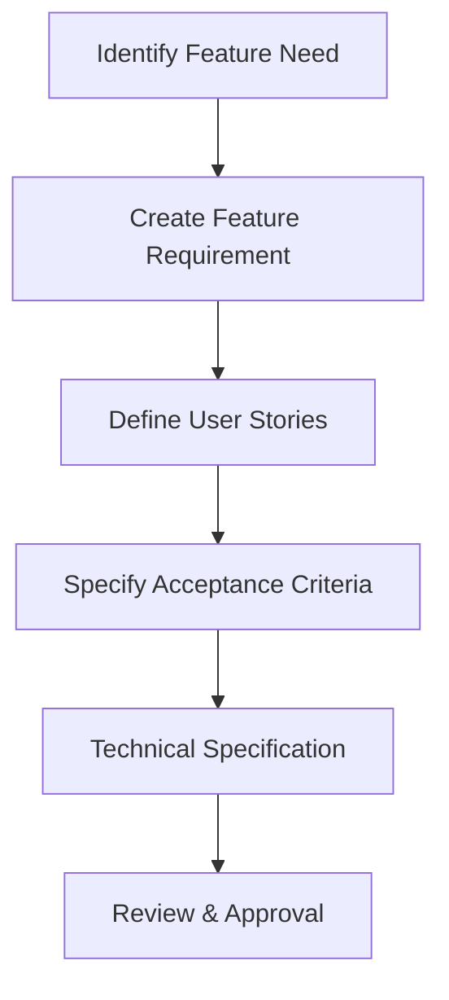
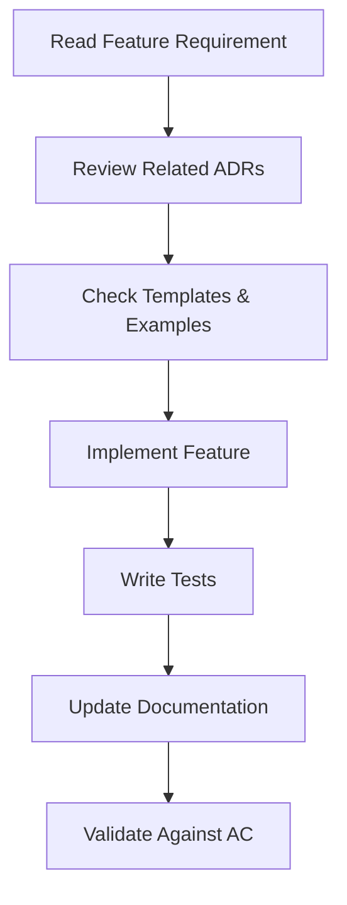
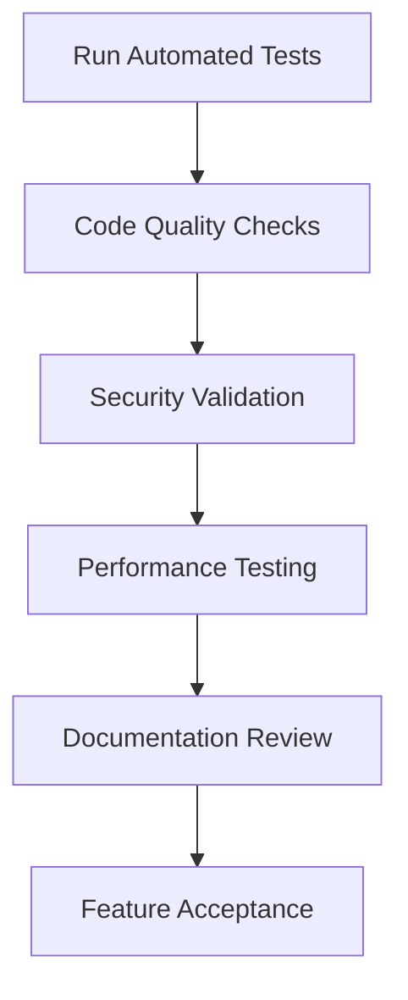

# Feature Requirements Framework

## Overview

This framework provides a structured approach for defining, implementing, and validating features for this project. It's specifically designed to work effectively with AI agents like Claude Code and GitHub Copilot.

## Requirements Directory Structure

```
docs/requirements/
├── README.md                           # This file
├── TEMPLATE.md                         # Feature requirement template
├── feature-specifications/             # Detailed feature specs
│   └── FR-XXX-feature-name.md          # Feature specification
├── user-stories/                       # User story templates and examples
│   ├── template.md                     # User story template
│   └── examples/                       # Example user stories
└── acceptance-criteria/                # Acceptance criteria templates
    ├── template.md                     # AC template
    └── examples/                       # Example acceptance criteria
```

## Feature Development Workflow

### 1. Requirements Definition Phase


### 2. AI Agent Implementation Phase


### 3. Quality Assurance Phase


## Feature Requirement Process

### Step 1: Create Feature Requirement
Use the template in `TEMPLATE.md` to create a new feature requirement:

```bash
# Copy template
cp docs/requirements/TEMPLATE.md docs/requirements/feature-specifications/FR-XXX-feature-name.md

# Edit the new file with feature details
# Follow the template structure
```

### Step 2: AI Agent Implementation
AI agents should follow this workflow:

1. **Read the Feature Requirement**: Understand the complete requirement
2. **Review Related ADRs**: Check which architectural decisions apply
3. **Use Appropriate Templates**: Start with relevant templates from `templates/`
4. **Follow Examples**: Reference similar implementations in `examples/`
5. **Implement Incrementally**: Build feature step by step
6. **Test Continuously**: Write and run tests throughout development
7. **Update Documentation**: Keep all documentation current

### Step 3: Validation and Acceptance
- All acceptance criteria must pass
- Code quality gates must be met
- Tests must achieve required coverage
- Documentation must be updated
- Security requirements must be satisfied

## Feature Types and Templates

### Cross-Cutting Concerns
All features must address:
- **Error Handling** (ADR-003)
- **Type Safety** (ADR-005)
- **Logging** (ADR-007)
- **Testing** (ADR-006)
- **Security** (Input validation, safe error messages)
- **Performance** (Monitoring and optimization)
- **Text Processing** (ADR-008)

## AI Agent Guidelines

### Before Starting Implementation
```markdown
1. **Read Feature Requirement**: docs/requirements/feature-specifications/FR-XXX-*.md
2. **Check Related ADRs**: Review relevant architectural decisions
3. **Review Templates**: Use appropriate templates from templates/
4. **Study Examples**: Look at similar implementations in examples/
5. **Plan Implementation**: Break down into small, testable units
```

### During Implementation
```markdown
1. **Follow Patterns**: Use established patterns from ADRs and examples
2. **Write Tests First**: TDD approach with comprehensive test coverage
3. **Add Logging**: Include structured logging throughout
4. **Handle Errors**: Use established error handling patterns
5. **Validate Types**: Ensure type safety at compile and runtime
6. **Document Code**: Comprehensive docstrings and comments
```

### After Implementation
```markdown
1. **Run All Tests**: Ensure no regressions
2. **Check Quality Gates**: Pass all automated checks
3. **Update Documentation**: Keep all docs current
4. **Validate Acceptance Criteria**: Ensure all criteria are met
5. **Performance Testing**: Verify performance requirements
```

## Quality Gates

### Code Quality Requirements
- **Type Checking**: 100% mypy compliance
- **Linting**: 100% ruff compliance  
- **Formatting**: 100% black compliance
- **Test Coverage**: 95% minimum coverage
- **Documentation**: All public APIs documented
- **Security**: No security violations

### Performance Requirements
- **Startup Time**: < 100ms for CLI startup
- **Operation Time**: < 10ms for basic operations
- **Memory Usage**: < 50MB for typical usage
- **Plugin Loading**: < 500ms for plugin initialization

### Security Requirements
- **Input Validation**: All inputs validated
- **Error Handling**: No sensitive data in error messages
- **Plugin Security**: Plugin isolation and validation
- **Audit Logging**: Security events logged

## Integration with Development Tools

### GitHub Copilot Integration
- Requirements are structured for easy parsing
- Templates provide clear patterns for suggestions
- Examples show complete implementations
- ADRs provide architectural context

### Claude Code Integration
- Feature requirements include complete context
- Technical specifications reference all relevant documentation
- Implementation guidance is explicit and detailed
- Quality gates are clearly defined

### CI/CD Integration
- Automated validation of requirements compliance
- Quality gate enforcement
- Documentation synchronization
- Test execution and reporting

## Metrics and Monitoring

### Development Metrics
- **Feature Velocity**: Features implemented per sprint
- **Quality Score**: Automated quality metrics
- **Test Coverage**: Code coverage trends
- **Documentation Coverage**: API documentation completeness

### AI Agent Effectiveness
- **Implementation Accuracy**: Features meeting acceptance criteria
- **Pattern Compliance**: Adherence to established patterns
- **Code Quality**: Automated quality scores
- **Time to Implementation**: Development speed metrics

## Future Enhancements

### Planned Improvements
1. **Automated Requirement Validation**: Tools to validate requirement completeness
2. **AI-Powered Requirement Generation**: Generate requirements from user descriptions
3. **Interactive Development**: Real-time AI agent guidance during development
4. **Quality Prediction**: Predict feature quality before implementation
5. **Automatic Documentation**: Generate documentation from implementation

### Integration Opportunities
1. **Project Management**: Jira, Linear, or GitHub Issues integration
2. **Design Tools**: Figma or other design tool integration
3. **Testing Platforms**: Advanced testing and validation platforms
4. **Monitoring**: Production monitoring and feedback loops

## Getting Started

### For New Features
1. **Create Feature Requirement**: Use the template to define your feature
2. **Assign Feature ID**: Use next available FR-XXX number
3. **Review with Team**: Get stakeholder approval
4. **Begin Implementation**: Follow the AI agent workflow
5. **Track Progress**: Monitor against acceptance criteria

### For AI Agents
1. **Read This Framework**: Understand the complete process
2. **Study Templates**: Familiarize yourself with all templates
3. **Review Examples**: Understand implementation patterns
4. **Check ADRs**: Know the architectural decisions
5. **Start Small**: Begin with simple features to learn the patterns

## Support and Resources

### Documentation
- **PROJECT_OVERVIEW.md**: Overall project context
- **CODING_STANDARDS.md**: Code quality requirements
- **ADRs**: Architectural decision records
- **Examples**: Working implementation examples
- **Templates**: Starting point templates

### Community
- **GitHub Issues**: Bug reports and feature requests
- **Pull Requests**: Code review and collaboration
- **Documentation**: Continuous improvement of processes

---

**Last Updated**: 2025-07-07  
**Next Review**: 2025-08-07  
**Version**: 1.0.0
